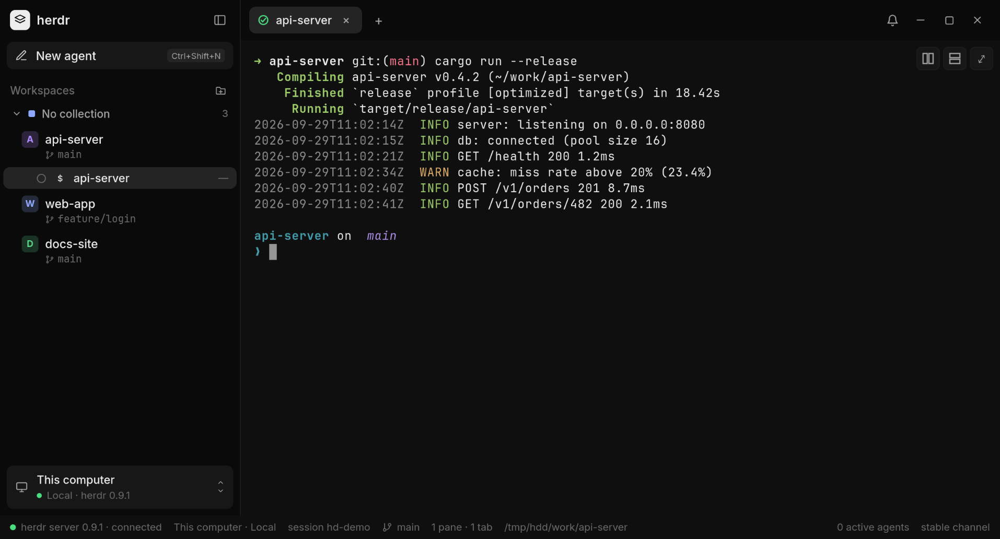

# Herdr Desktop

A lightweight desktop client for the [Herdr](https://github.com/herdrdev/herdr) engine.
Coding agents and terminals in the centre, local and remote projects on the side, and a
supporting editor — all of it attached to a Herdr server that keeps running when the window
is closed.



## What it is

Herdr is a terminal multiplexer for coding agents: it owns the PTYs, detects the agents and
keeps their sessions alive. Herdr Desktop is a companion client for it — it does not run
terminals of its own. The app connects to a Herdr server over the endpoint protocol
(generation 1), renders the panes the server publishes, and sends your input back.

Because the sessions belong to the server, closing the window never stops an agent. Reopen
the app, reconnect to the same host, and the panes are where you left them.

- Local host, plus any number of SSH hosts saved in the app.
- Workspaces and tabs grouped per host, with agent status in the sidebar.
- Terminal rendering fed by the server's surface frames (no polling).
- Supporting editor and a read-only file browser, including remote files over SFTP.
- Interface in English, Portuguese and Spanish.

## Requirements

Herdr Desktop is a client: **it needs a working Herdr installation** on every machine it
connects to. Without Herdr the window opens but has nothing to show.

### 1. Herdr (required)

- **Version:** Herdr **0.9.x** (the app negotiates endpoint protocol **generation 1** and never
  falls back silently to anything else).
- **Install** — commands from [herdr.dev](https://herdr.dev) (see its
  [quick start](https://herdr.dev/docs/quick-start/)):

  **Linux**

  ```bash
  curl -fsSL https://herdr.dev/install.sh | sh
  # or, with Homebrew on Linux:  brew install herdr
  # or, with mise:               mise use -g herdr
  ```

  **macOS**

  ```bash
  brew install herdr
  # or: curl -fsSL https://herdr.dev/install.sh | sh
  # or: mise use -g herdr
  ```

  **Windows** (PowerShell)

  ```powershell
  powershell -ExecutionPolicy Bypass -c "irm https://herdr.dev/install.ps1 | iex"
  # or, with mise: mise use -g herdr
  ```

  On endpoint-protected Windows machines, follow
  [Herdr's Windows notes](https://herdr.dev/docs/windows-beta/). Prebuilt binaries for every
  platform are on the [Herdr releases page](https://github.com/herdrdev/herdr/releases).
- **Check it works** — `herdr` must be on the `PATH` of the user that runs the app:

  ```bash
  herdr --version        # expect: herdr 0.9.x
  ```

- **The local session.** You do not need to start anything by hand: on launch the app attaches
  to your default Herdr session and, if its server is not running, starts it in the background
  (the same thing the Herdr TUI does). Closing the window leaves the server and every agent
  running. To use another session, set `HERDR_DESKTOP_SESSION=<name>` before launching the app
  (an explicit session is attached, never auto-started).

### 2. SSH hosts (optional)

- OpenSSH client on this computer. The app reuses your `~/.ssh/config`, keys and agent; it never
  asks for or stores a password.
- **Herdr 0.9.x installed on each remote host**, reachable on the `PATH` of a non-interactive SSH
  login (`ssh <host> herdr --version` must print the version).

### 3. Coding agents (optional)

The agents you want to run — Claude Code, Codex, Gemini, OpenCode, and so on — installed on the
machine where the Herdr session runs. Herdr detects them; "New agent" lists the kinds the
server supports and dims the ones whose binary is not on the local `PATH`.

### 4. Desktop platform

- Linux with GTK 3 and WebKitGTK (`webkit2gtk-4.1`) — see [docs/building.md](docs/building.md)
  for the exact packages.
- macOS and Windows builds are produced by the release workflow but are not verified yet (see
  [Platform status](#platform-status)).

## Install

Download the artifact for your system from the
[Releases page](https://github.com/fabiojansenbr/herdr-desktop/releases) and install it the
usual way for that format. [docs/releasing.md](docs/releasing.md) lists what each tag
publishes.

There is no release yet while the first version is being prepared. Until then, build from
source — [docs/building.md](docs/building.md) walks through it.

## Basic use

**Connect to the local host.** On first start the app offers the Local connection — "This
computer". It attaches to the Herdr server running there and lists its workspaces and tabs
in the sidebar.

**Add an SSH host.** Open the connection dialog, pick the SSH type and fill in the host
(`user@host`, or an alias from your `~/.ssh/config`), optionally a port, a display name and
the session to attach to. The host is saved and appears in the sidebar next to Local; the
badge tells you which host a tab belongs to. Remote files are read-only in this version and
are marked as such in the interface.

**Start an agent.** "New agent" (`Ctrl+Shift+N`) opens the list of agent kinds the server
knows — Claude Code, Codex, Copilot, Gemini and the rest. Kinds whose binary is not on the
`PATH` of the local machine are dimmed but still selectable. Pick one and it starts in a new
pane on the focused workspace.

**Everything else.** `Ctrl+K` opens the command palette, which searches projects, panes,
agents and commands; `Ctrl+B` toggles the sidebar; `Ctrl+T` opens a tab. Inside a terminal,
copy and paste are `Ctrl+Shift+C` and `Ctrl+Shift+V`, and `Ctrl+Shift+F6` gives the keyboard
back to the window.

**Change the language.** The interface follows the system language by default. To pin one,
open the command palette and search for "Language" ("Idioma" in Portuguese and Spanish) and
choose Automatic, English, Português or Español.

## Platform status

| Platform | Status |
|---|---|
| Linux | Supported and tested: the whole test suite, including the native end-to-end tests, runs here. |
| macOS | Built by the release workflow, **not verified** — no maintainer has run the produced bundle on macOS. |
| Windows | Built by the release workflow, **not verified** — no maintainer has run the produced bundle on Windows. |

Reports from macOS and Windows users are welcome; please say which version you ran in the
[bug report](.github/ISSUE_TEMPLATE/bug_report.md).

## Documentation

- [CONTRIBUTING.md](CONTRIBUTING.md) — development environment, validation commands, conventions.
- [docs/building.md](docs/building.md) — system dependencies and how to build.
- [docs/releasing.md](docs/releasing.md) — versioning, tags and release artifacts.
- [docs/architecture.md](docs/architecture.md) — how the pieces fit together.
- [SECURITY.md](SECURITY.md) — reporting a vulnerability.

## License

Apache License 2.0 — see [LICENSE](LICENSE).

Third-party attributions are in [NOTICE](NOTICE): the mirrored Herdr wire contract in
`vendor/herdr-protocol` (Apache-2.0) and the Inter font (SIL OFL 1.1). Full license texts are
under [LICENSES/](LICENSES/).
